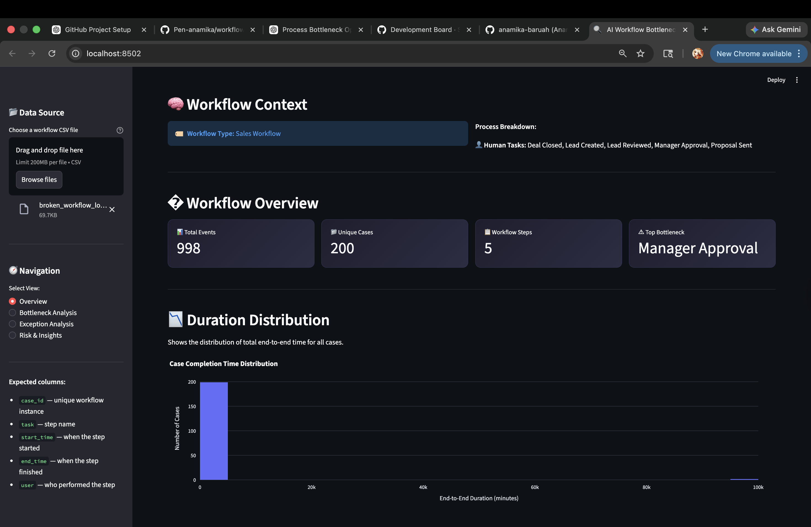
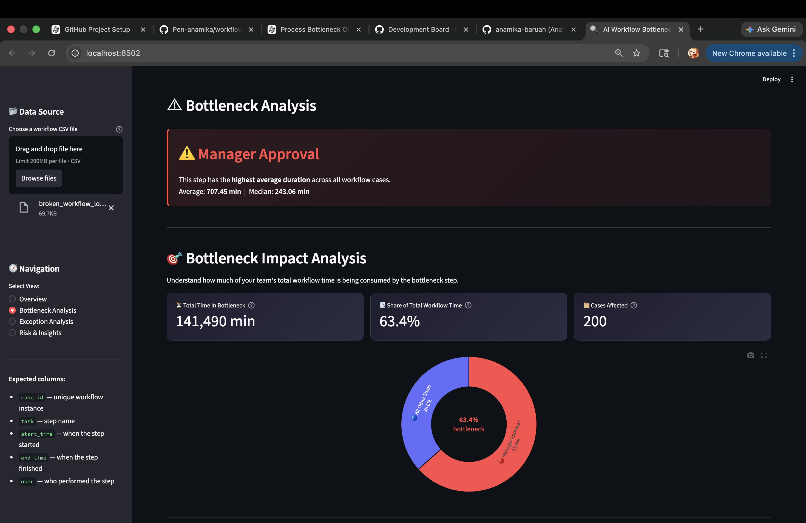
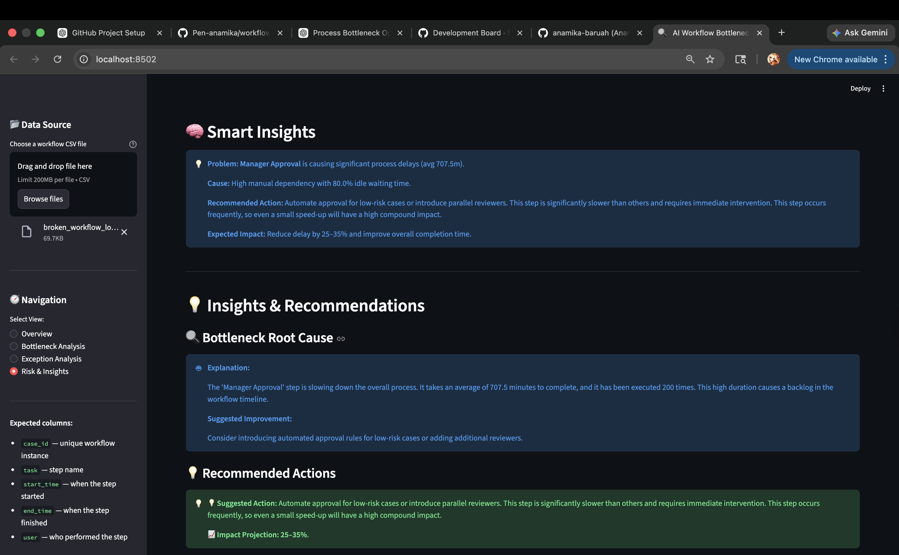

# 🚀 AI Workflow Intelligence System

> **Turn raw workflow logs into actionable business decisions using AI-driven process intelligence.**

[](https://python.org)
[](https://streamlit.io)
[](https://plotly.com)
[](https://pandas.pydata.org)
[]()

---

## 📌 Overview

Most businesses run on complex, multi-step workflows — Sales pipelines, Support queues, HR onboarding — but as volume scales, **it becomes impossible to know where time is being lost.**

The **AI Workflow Intelligence System** is an operations intelligence and decision-support platform that automatically ingests raw workflow event logs and surfaces the insights that matter most:

- *Which step is creating the most delay?*
- *Is the bottleneck caused by workload or just waiting in a queue?*
- *What's the fastest, highest-ROI fix?*

Rather than building another metrics dashboard, this system acts as a **strategic analytical layer** — translating raw operational data into structured, boardroom-ready decisions. It moves your team from reactive firefighting to proactive, evidence-based optimization.

---

## ✨ What Makes This Different?

Most analytics tools stop at visualization. This system goes further:

| Typical Dashboard | AI Workflow Intelligence System |
|---|---|
| Shows *what* happened | Explains *why* it happened |
| Displays metrics | Prescribes specific actions |
| Reports the past | Predicts future risks |
| Requires manual interpretation | Generates structured decision chains |

- 🔍 **Not just visualization** — it diagnoses the root cause behind every delay
- 🎯 **Suggests exactly what to do** — with a Problem → Cause → Action → Impact decision chain
- 💰 **Quantifies business impact** — so you can justify every optimization decision with data
- ⚠️ **Predicts risks before they happen** — using statistical variability analysis across task patterns

👉 *Acts like a mini operations consultant, not just an analytics tool.*

---

## ❗ Problem Statement

In any modern enterprise, operational efficiency quietly erodes due to:

- **Invisible Bottlenecks** — A single approval step (like "Manager Review") can silently consume 60%+ of total process time without anyone noticing until it impacts revenue.
- **Zero Visibility into Idle Time** — There's no easy way to distinguish between *active human work* and time a task simply spends sitting in a queue waiting to be picked up.
- **Approval Bottlenecks That Don't Scale** — Manual verification and sign-off processes that worked at 100 cases/month break completely at 10,000.
- **Process Deviations Going Undetected** — Tasks being skipped, repeated unnecessarily ("rework loops"), or executed out of sequence create hidden quality and compliance risks.
- **No Predictive Layer** — Teams only discover a process is failing *after* SLAs are already breached, not before.

These aren't edge cases. They're the silent drains on efficiency in every operations, sales, and support team — and they're largely invisible without the right tooling.

---

## 💡 Solution

This system provides a high-fidelity diagnostic and decision engine for any business process:

- **Pinpoints the Exact Bottleneck** — Identifies which specific task in the workflow is the primary constraint, with precise time data.
- **Decodes Root Causes** — Determines whether a delay is from *task complexity* (hard work) or *queue time* (pure waiting), which leads to completely different fixes.
- **Structured Decision Chains** — Every insight is delivered in a clear **Problem → Cause → Action → Expected Impact** format — no ambiguity, just clear next steps.
- **Automation Roadmap** — Identifies which steps are candidates for RPA or rule-based automation, with estimated time savings per recommendation.
- **Risk Prediction** — Flags tasks with high statistical variability as future failure points *before* they breach SLAs, using a transparent 0–100 risk score.

---

## 🎯 Why This Project Matters

Operational inefficiency is a massive, hidden cost center for every company at scale. Research consistently shows that organizations lose 20–30% of revenue annually to broken or inefficient processes. The challenge isn't a lack of data — it's the lack of a system to interpret that data and translate it into action.

This project simulates exactly the kind of tooling modern operations, RevOps, and business intelligence teams are investing in:

- Replacing manual process audits with automated analysis
- Giving managers the *why* behind performance drops, not just the *what*
- Creating a feedback loop between process data and continuous improvement

👉 *Simulates real-world operational intelligence systems used in modern companies.*

---

## ⚙️ Features

- ⚡ **Bottleneck Detection** — Real-time identification of the primary process constraint, ranked by total time consumed and case volume.
- ⏱️ **SLA Compliance Analysis** — Monitors performance against defined Service Level Agreements (e.g., Lead Review < 30 mins) and surfaces breach patterns.
- ⏳ **Waiting vs. Processing Time Breakdown** — Statistical separation of active work time from idle queue time — the key to knowing *where* to intervene.
- ⚠️ **Exception Flow Detection** — Automated discovery of rework loops (repeated tasks) and sequence deviations (steps executed out of order).
- 📊 **Workflow Health Score (0–100)** — An executive-ready composite metric with AI-driven explainability detailing exactly which factors are driving the score up or down.
- ⚙️ **Automation Opportunities** — Targeted recommendations for process automation with estimated ROI and time-reduction impact per suggestion.
- 🧠 **Smart Insights Engine** — Decision blocks linking each operational problem directly to its root cause, recommended action, and expected business impact.
- 🎯 **Risk Prediction** — Transparent 0–100 risk scores per task with plain-language explanations of the contributing risk factors.

---

## 🧠 How It Works

**Simple View:**
```
Upload Workflow CSV  →  System Analyzes  →  Dashboard Surfaces Insights  →  You Take Action
```

**Detailed Pipeline:**

```
📂 Data Ingestion          Upload raw CSV event logs (case_id, task, start_time, end_time, user)
        ↓
🔧 Preprocessing           Timestamp cleaning, duration calculation, waiting-time simulation
        ↓
🔬 Discovery & Analysis    SLA compliance, bottleneck severity, variability scoring, exception detection
        ↓
🧠 Strategic Synthesis     AI layer converts metrics into structured insights and health scores
        ↓
📊 Streamlit Dashboard     Multi-page executive interface with interactive Plotly visualizations
```

Each stage is modular and independently testable, making the system easy to extend with new analysis engines or data sources.

---

## 🖥️ Dashboard Preview

> *Dashboard screenshots are stored in the `assets/` directory.*


*Workflow Health Score panel with executive-ready Smart Insights and risk flags.*


*Waiting vs. Processing time breakdown with step-level drill-down.*


*Detailed AI-driven insights with Problem-Cause-Action-Impact chains.*

---

## 🌐 Live Demo

Live demo coming soon. The application can currently be run locally using Streamlit.

---

## 📊 Example Insights

Here's the kind of output the system produces from real workflow data:

**🔴 Bottleneck Alert**
> `"Manager Approval"` consumes an average of **707 minutes** per case — accounting for **63% of total workflow time**. Primary driver: queue wait time, not task complexity.

**⚙️ Automation Recommendation**
> *"Introduce rule-based auto-approval for low-risk cases under a defined threshold."*
> Expected Impact: **~25% reduction in end-to-end cycle time.**

**⚠️ Risk Prediction**
> `"Lead Reviewed"` — **High Risk Score: 82/100**
> Why: Extreme duration variability (σ = 340 mins) combined with high execution volume creates a statistically likely SLA breach point within the next operational cycle.

---

## 🛠️ Tech Stack

| Layer | Technology | Purpose |
|---|---|---|
| Language | Python 3.9+ | Core application logic |
| Data Engine | Pandas | Vectorized event log processing |
| Visualization | Plotly | Interactive, high-fidelity charts |
| Interface | Streamlit | Multi-page analytics dashboard |
| Analytics | Custom Statistical Engines | Risk scoring, health metrics, bottleneck math |

---

## 📂 Project Structure

```
ai-workflow-intelligence/
│
├── dashboard/
│   └── app.py                  # Main multi-page Streamlit application
│
├── src/
│   ├── preprocessing.py        # Timestamp parsing, duration calculation, SLA tagging
│   ├── bottleneck_detector.py  # Bottleneck ranking and impact quantification
│   ├── risk_predictor.py       # Statistical variability and risk scoring
│   ├── health_analyzer.py      # Composite 0–100 Workflow Health Score
│   ├── automation_engine.py    # Automation opportunity matching with ROI estimates
│   ├── insight_engine.py       # Problem → Cause → Action → Impact chain generation
│   └── context_analyzer.py    # Industry classification and human/system task detection
│
├── data/                       # Directory for input CSV workflow logs
├── assets/                     # Screenshots and visual documentation
└── requirements.txt            # All project dependencies
```

---

## ▶️ How to Run

**1. Clone the Repository**
```bash
git clone https://github.com/your-username/ai-workflow-intelligence.git
cd ai-workflow-intelligence
```

**2. Install Dependencies**
```bash
pip install -r requirements.txt
```

**3. Launch the Dashboard**
```bash
streamlit run dashboard/app.py
```

**4. Upload Your Data**

Use any CSV with the following columns:

| Column | Description |
|---|---|
| `case_id` | Unique identifier for each workflow instance |
| `task` | Name of the process step |
| `start_time` | Task start timestamp |
| `end_time` | Task completion timestamp |
| `user` | Agent or system that executed the task |

> 💡 Don't have data? Generate a sample dataset instantly:
> ```bash
> python src/generate_dataset.py
> ```

---

## 🎯 Use Cases

- **Sales Pipeline Optimization** — Identify exactly where leads stall in the pipeline and reduce lead-to-close time through targeted automation of approval steps.
- **Customer Support Monitoring** — Separate active ticket resolution time from idle queue time; find which support categories are consistently breaching SLA.
- **Business Process Governance** — Ensure cross-departmental workflows comply with stated SLAs; flag deviations and rework loops before they become systemic issues.

---

## 👩‍💻 Author

**Anamika Baruah**  
*Final Year MCA Student*

Passionate about building intelligent systems that sit at the intersection of data analytics, AI, and real-world business problem solving. This project reflects a conviction that the highest-value AI applications don't just surface data — they help people make better decisions faster.

[](https://www.linkedin.com/in/anamika-baruah/)
[](https://github.com/anamika-baruah)

---

*Built as part of the AI Process Intelligence project — developed independently to explore applied operational analytics.*